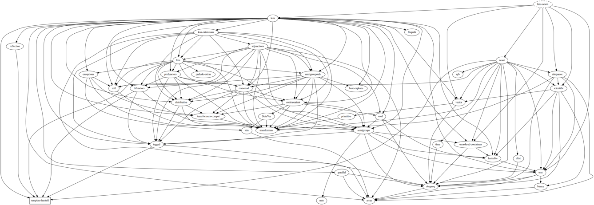
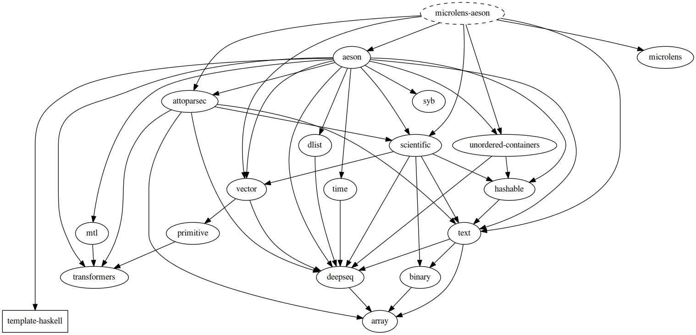

microlens-aeson
===============

[](https://travis-ci.org/fosskers/microlens-aeson)

`microlens-aeson` provides Traversals for the
[Aeson](http://hackage.haskell.org/package/aeson) library's `Value` type,
while obeying the `Traversal` laws.

`microlens-aeson` is derived from `lens-aeson`, but is based upon `microlens`
to reduce the amount of dependencies involved.

Here is the dependency graph for `lens-aeson`:



And that for `microlens-aeson`:



Usage
-----
`microlens-aeson` provides Traversals into both lazy and strict variants
of all the text types. Here are some examples:

```haskell
{-# LANGUAGE OverloadedStrings #-}

import Data.Aeson
import Data.Text (Text)
import Lens.Micro.Aeson

--------------------------
-- Manipulating primatives
--------------------------
-- | Optionally getting one value
a :: Maybe Int
a = ("37" :: Text) ^? _Integer  -- Just 42

-- | Setting one value within encoded JSON
b :: Maybe Text
b = "true" & _Bool .~ False  -- "false"

----------------------
-- Manipulating arrays
----------------------
-- | Get all values as an Aeson type.
c :: [Value]
c = "[1, 2, 3]" ^.. values  -- [Number 1.0, Number 2.0, Number 3.0]

-- | Get all values cast to some simpler number type.
d :: [Double]
d = "[1, 2, 3]" ^.. values . _Double  -- [1.0, 2.0, 3.0]

-- | Access a specific index, and set a `Value` directly.
e :: Text
e = "[1,2,3]" & nth 1 .~ Number 20  -- "[1,20,3]"

-----------------------
-- Manipulating objects
-----------------------
-- | Access all values of the key/value pairs.
f :: Text
f = "{\"a\":4,\"b\":7}" & members . _Number %~ (*10)  -- "{\"a\":40,\"b\":70}"

-- | Access via a given key.
g :: Maybe Value
g = ("{\"a\": 100, \"b\": 200}" :: Text) ^? key "a"  -- Just (Number 100.0)

-----------------------------------
-- Aeson `Value`s from encoded JSON
-----------------------------------
h :: Maybe Text
h = "{\"a\":4,\"b\":7}" ^? _Value
-- Just (Object (fromList [("a",Number 4.0),("b",Number 7.0)]))
```

See the Haddock documentation for a full API specification.
